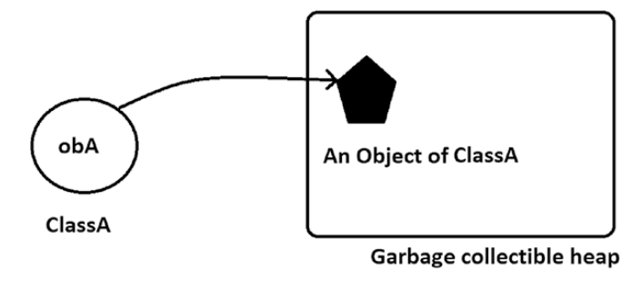

# The Building Blocks: Class and Objects

Object-oriented programming (OOP) techniques primarily depend on two concepts—class and objects.

## Class

A class is a blueprint, template, or prototype. It can describe the behaviors of its objects and is the foundation for how the objects are built or instantiated.

## Object

An object is an instance of a class.

---

You can consider any domain. For example, you could say that your pet dogs or cats are objects of the *Animal* class. Similarly, your favorite car could be considered an object of the *Vehicle* class, your favorite novel could be considered an object of the *Book* class, and so on.

In a real-world scenario, each of the objects must have two basic characteristics: state and behavior. If you consider the objects—*Ronaldo* or *Beckham* from the `Footballer` class—you may notice that they have states like “playing” or “non-playing.” In the playing state, they can show different skills (or behaviors)—they can run, they can kick, they can pass the ball, and so forth.

In a non-playing state, the behavior will also change. In this state, they can take a much-needed nap, or they can eat their meals, or they can simply relax by doing activities like reading a book, watching a movie, and so forth.

---

So, to begin with object-oriented programming, you can ask the following questions:
  * What are the possible states of my objects?
  * What are the different functions (behaviors) that they can perform in those states?

Once you get the answers to these questions, you are ready to proceed. Software objects follow the same pattern in any object-oriented program: their states are stored in fields (variables), and their capabilities (behaviors) are described through different methods (functions).

---

> * You start with the class, which is the architectural blueprint. A class defines the structure and behavior of the objects. From a single blueprint, you can construct multiple buildings. Similarly, from a single class, you can construct multiple objects (or instances).
> * With a class, you create a new data type, and objects are used to hold the data (fields) and methods. Object behavior can be exposed through these methods.

In Java, you can create a class as follows:

```Java
/* A.java */
class A {
    //This is a single-line comment.
    //Here is some data, for example,
    int a;
    //Here is a method, for example,
    void someMethod() {
        //Some code
    }
}
```

You can see that to create a class, you need to use the `class` keyword. (The single-­line comments’ // are used for better readability.) The class body is enclosed with curly braces—{ and }. The data or variables inside a class are termed **instance variables**. You can have some methods in your class. Collectively, these data and methods are referred to as **class members**.

You can create an object from it. Let’s say your object is `obA`, which can be created with the following statement:

```Java
A obA = new A();
```
You can split the preceding statement into the following two lines:

```Java
A obA;  //Line-1
obA=new A();  //Line-2
```
It is important to note that at the end of Line 1, obA is a **reference**. Up to this point, no memory has been allocated, and `obA` contains null. But once the `new` operator comes into the picture, the memory is allocated for it. So, at the end of Line 2, the `new` operator allocates the memory for the physical object and assigns a reference to it to `obA`.

---

> A class is a logical entity. Once you instantiate a class, you create objects. These objects occupy memory in your system. So, objects are physical entities. In the preceding code snippet, the new operator is used to create an object of class A. It allocates memory to it and returns an object of the class A, whose reference is stored in the variable `obA`.

---

## Constructor

If you look carefully, you will observe that after the `new` keyword, the class name is followed by a parenthesis. You use this approach to construct an object. These are **constructors** that are used to run initialization codes. Constructors can be both parameterized and non-parameterized. So, you can pass different arguments to them. In simple words, constructors can vary, with a different **number** of parameters or different **types** of parameters. 

In the following example, class A has four different constructors.

```Java
class A {
    public A() {
        System.out.println("Constructor with no parameter");
    }

    public A(int a) {
        System.out.println("Constructor with one integer parameter");
    }

    public A(int a,int b) {
    System.out.println("Constructor with two integer parameter");
    }

    public A(double a) {
    System.out.println("Constructor with one double parameter");
    }
}
```

If you do not supply any constructor for your class, Java will supply a default one for you.

---

> The compiler supplies a no-argument default constructor if you do not include any constructor for your class.

So, when you see something like the following, you can be sure that a parameterless
constructor will be used:

```Java
A obA = A();
```

But to know whether it is a user-defined constructor or was provided by Java (in other words, a default constructor), you need to examine the class body; for example, in a class definition, if you have code like

```Java
class A {
    A() {
        // Some code
    }
}
```

You **encapsulate** the variables and methods inside a class to make a single unit. These variables are called as instance variables because each instance of this class contains its own copies of these variables.  Instance variables are generally accessed through methods. As said before, collectively, these variables and methods are called class members.

### Demostration 1

Consider the next simple example.

```Java
class ClassEx1 {
    // Field initialization is optional.
    // Here myInt is initialized with the value 25.
    public int myInt = 25;
    // In the following case, it will be initialized with default value 0.
    // public int myInt;
}

class Demonstration1 {
    public static void main(String[] args) {
        System.out.println("***Demonstration-1. A class demo with 2 objects ***");
        ClassEx1 obA = new ClassEx1();
        ClassEx1 obB = new ClassEx1();
        System.out.println("obA.myInt = " + obA.myInt);
        System.out.println("obB.myInt = " + obB.myInt);
    }
}
```

To run:

```Bash
$ javac Demonstration1.java
$ java Demonstration1
```

  * What happens if the field `myInt` it's no initialize?
  * What happens if the field `Int` is initialized in the constructor?

> You must remember these key points about constructors:
>   * Constructors are used to initialize objects.
>   * The class name and the corresponding constructor’s name(s) must be the same.
>   * Constructors do not have any return types.
>   * There are two types of constructors: parameterless constructors (sometimes referred to as constructors with no argument or default constructor) and constructors with parameter(s) (known as parameterized constructors).
>   * In general, the common tasks, like initialization of all the variables
inside a class, are achieved through constructors.


## Q&A Session
  * The constructors do not have any return type. With this statement, did you mean that their return type is void?.
  
  * I am little bit confused about the use of a user-defined parameterless constructor versus a default constructor that is supplied by Java. Is there any key difference between them?. 


### Demonstration 2

Consider the following example and analyze the output:

```Java
class DefConsDemo {
    public int myInt;
    public float myFloat;
    public double myDouble;
    public DefConsDemo() {
        System.out.println("I am initializing with my own choice.");
        myInt = 10;
        myFloat = 0.123456f;
        myDouble = 9.8765432;
    }
}

class DefaultConstructorCaseStudy { 
    public static void main(String[] args) {
        System.out.println("***Demonstration-2.Comparison between user-defined and Java-provided default constructors***\n");
        DefConsDemo ObDef = new DefConsDemo();
        System.out.println("myInt="+ ObDef.myInt);
        System.out.println("myFloat="+ ObDef.myFloat);
        System.out.println("myDouble="+ ObDef.myDouble);
    }
}
```
---

Suppose you have compiled the following class:


```Java
class DefConsDemo {
    public int myInt;
    public float myFloat;
    public double myDouble;
}
```

Then you can decompile the class file to see that *Java* makes a default constructor for us.

```Bash
$ javap DefConsDemo.class
```

You can notice the Java-provided default constructor present in the decompiled file.

---

  * I am seeing that the Java-provided default constructor is initializing the instance variables with some default values. What are the default values for other types?

In general, the default values are zero or null. You can refer to next Table:

| Data Type | Default Values |
|:---|---:|
| byte, short, int | 0 |
| char | ‘\u0000’ |
| float | 0.0f |
| double | 0.0d |
| long | 0L |
| String | null |
| Any object | null |
| boolean | false |

  * It appears to me that you can also invoke some methods to initialize those variables. Why do you need constructors?. 

---
  
  *  Can you predict the output of the following?
```Java
class ConEx2 {
    int i;

    public ConsEx2(int i) {
        this.i = i;
    }
    // public ConsEx2() { }
}

public class Quiz1 {
    public static void main(String[] args) {
        System.out.println("***Experiment with constructor***");
        ConEx2 ob = new ConEx2 ();
        //ConsEx2 ob = new ConsEx2(25);//Choice-3
    }
}
```

  * You should get a default constructor from Java in this case. Why is the compiler complaining about this code snippet?

---

  * Can I say that a class is a custom type?
  
---
  * Can you elaborate on the concept of reference?

Suppose you have a simple class like the following:

```Java
class ClassA {
    //An instance variable
    int a;
    //An instance method, for example:
    void someMethod() {
        //Some code
    }
}
```
The following figures for a better understanding of object reference variables. 



---

  * These references are similar to C/C++ pointers. Is this correct?
---
  * Can I have multiple reference variables that refer the same object in memory?

---

### Demonstration 3

```Java
class ClassEx3 {
    public int i;
    public ClassEx3(int myInteger) {
        this.i = myInteger;
        // i = myInteger results in the same
    }
}

class Demonstration3 {
    public static void main(String[] args) {
        System.out.println("***Demonstration-3.A class demo with 2 objects ***");
        ClassEx3 obA = new ClassEx3(10);
        ClassEx3 obB = new ClassEx3(20);
        System.out.println("obA.i =" + obA.i);
        System.out.println("obB.i =" + obB.i);
    }
}
```
  * What is the purpose of the this keyword?
---

### Demonstration 4

In the following demonstration, you will see the use of two different constructors.

```Java
//Constructor overloading example
class ClassEx4 {
    int i;
    ClassEx4() {
        this.i = 5;
    }

    public ClassEx4(int i) {
        this.i = i;
    }
}

class Demonstration4 {
    public static void main(String[] args) {
        System.out.println("***Demonstration-4. A simple class with 2 different constructors ***");
        System.out.println("*** It is also an example of constructor overloading ***");
        ClassEx4 obA = new ClassEx4();
        ClassEx4 obB = new ClassEx4(75);
        System.out.println("obA.i =" + obA.i);
        System.out.println("obB.i =" + obB.i);

    }
}

```
---

### Demonstration 5

A class can have either variables or methods or both.

```Java
class ClassEx5 { 
    public int sum(int x, int y) {
        return x + y;
    }
}

class Demonstration5 { 
    public static void main(String[] args) {
        System.out.println("***Demonstration-5. A simple class with a method returning an integer ***\n");
        ClassEx5 ob = new ClassEx5();
        int result = ob.sum(57, 63);
        System.out.println("Sum of 57 and 63 is : " + result);
    }
}
```
---

### Demonstration 6 - Passing Variable-Length Arguments to Methods

```Java
class ClassEx6 {
    // The following method supports variable-length arguments
    public int sum(int... vararg) {
        System.out.println("You have passed " + vararg.length + "arguments now.");
        int total = 0;
        for (int i : vararg) {
            total = total + i;
        }
    return total;
    }
}

class Demonstration6 {
    public static void main(String[] args) {
        System.out.println("***Demonstration-6. Methods with variable-­length argument demo ***\n");
        ClassEx6 ob = new ClassEx6();
        int resultOfSummation = ob.sum(57, 63);
        System.out.println("Sum of 57 and 63 is : " + resultOfSummation);
        resultOfSummation = ob.sum(57, 63, 50);
        System.out.println("Sum of 57, 63 and 70 is : " + resultOfSummation);
        resultOfSummation = ob.sum(57, 63, 50, 70);
        System.out.println("Sum of 57, 63, 50 and 70 is : " + resultOfSummation);
    }
}
```

  * Why do I need vararg methods?

  * Can you give examples of some vararg methods in the Java library?
  
  *  What are the alternatives to vararg methods?

  *  Does Java support destructors?

---

## Summary

This chapter discussed the following topics:
  * The concepts of class, object, and reference
  * The difference between an object and a reference
  * The difference between a local variable and an instance variable
  * The different types of constructors and their usage
  * The differences between a user-defined parameterless constructor and a Java-provided default constructor
  * The use of `this` keyword
  * How to pass variable-length arguments to a method
  * The benefits of the object-oriented approach in real-world programming
